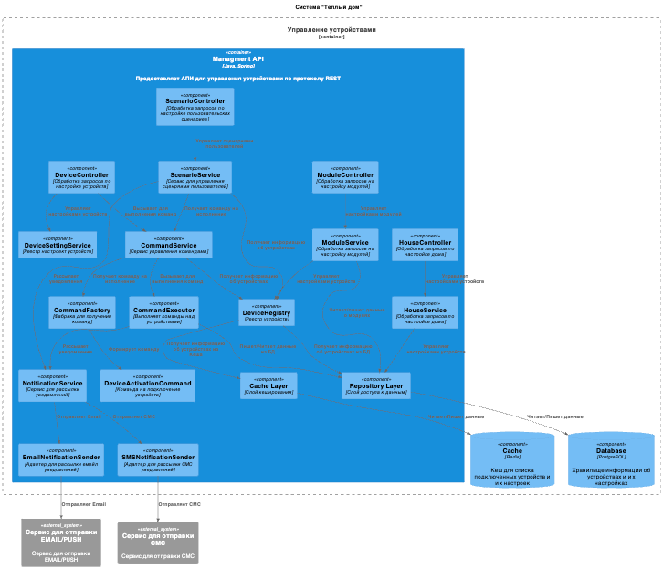
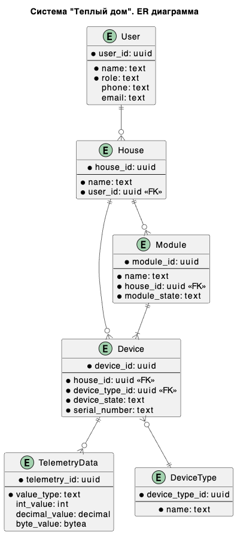

Это шаблон для решения **первой части** проектной работы. Структура этого файла повторяет структуру заданий. Заполняйте его по мере работы над решением.

# Задание 1. Анализ и планирование

Чтобы составить документ с описанием текущей архитектуры приложения, можно часть информации взять из описания компании условия задания. Это нормально.

### 1. Описание функциональности монолитного приложения

**Управление отоплением:**

- Пользователи могут удалённо включать/выключать отопление в своих домах.
- Пользователи могут удалённо получать/изменять температуру в своих домах.
- Система поддерживает удаленное обновление состояние системы отопления через веб интерфейс

**Мониторинг температуры:**

- Система получает данные о температуре с датчиков, установленных в домах. Пользователи могут просматривать текущую температуру в своих домах через веб-интерфейс.
- Система поддерживает добавелние новых датчиков, хранит информацию о датчиках в БД

### 2. Анализ архитектуры монолитного приложения

**Язык программирования**: Java 17

**Фреймворк**: Spring Boot 6

**Система сборки**: Maven 3.8.1

**База данных**: PostgreSQL 13

**Архитектура**: Монолитная, все компоненты системы (обработка запросов, бизнес-логика, работа с данными) находятся в рамках одного приложения.

**Взаимодействие**: 
- Синхронное, запросы обрабатываются последовательно.
- Синхронное получение информации из датчиков

**Масштабируемость**: 
- Ограничена, так как монолит сложно масштабировать по частям.
- Синхронное взаимоедйствие с датчиками существенно осложняет добавление новых.

**Развёртывание**: Требует остановки всего приложения.

### 3. Определение доменов и границы контекстов

**Домен**: управление устройствами
- **поддомен** управление температурой
  - **контекст**: изменение температуры 
  - **контекст**: ведение журнала температуры 
- **поддомен** управление состоянием устройств 
  - **контекст**: включение/выключение устройства
  - **контекст**: изменение настроект устройства

**Домен**: управление телеметрией
- **поддомен** обработка событий от датчиков
- **поддомен** мониторинг датчиков
- **поддомен** просмотр телеметрии

### **4. Проблемы монолитного решения**

- **Сильная связност**ь. Целевая экосистема предпологает активное развите двух направлениий - управление устройствами и обработка телеметриии от устройств. Оба этих доменна потребуют серьезной модернизации. В текущем решение независимое развитие этих систем будет затрудненно.
- **Синхронный характер взаимодействия и проблемы масштабирования**. В текущей архитектуре все взаимодействие синхронное. Целевая архитектура предполагает наличие 1 000 000 устройств. Синхронное взаимодействие не позволит **масштабировать** систему на такой объем событий.
- **Проблемы обновления системы**. Целевое решение должно быть легко расширяемым, что предпоалагет частое расширенеи функционала и частые релизы. В текущем монолите обновлиение системы влечет за собой простой и риски при обновлении. 
- **Отсуствие четко выделеного протокола общения**. В текущем решении нет четко выделенного протокола по которому можно было бы подключить внешние датчики к системе

### 5. Визуализация контекста системы — диаграмма С4

Добавьте сюда диаграмму контекста в модели C4.

Чтобы добавить ссылку в файл Readme.md, нужно использовать синтаксис Markdown. Это делают так:

[Context](./part1/Context.puml)

**Решение** 

**Легента**

# Задание 2. Проектирование микросервисной архитектуры

В этом задании вам нужно предоставить только диаграммы в модели C4. Мы не просим вас отдельно описывать получившиеся микросервисы и то, как вы определили взаимодействия между компонентами To-Be системы. Если вы правильно подготовите диаграммы C4, они и так это покажут.

**Диаграмма контейнеров (Containers)**

**Решение**

[Container](./part1/Container.puml)

**Диаграмма компонентов (Components)**

**Решение**

[Component Apigateway](./part1/Component_apigateway.puml)

[Component DeviceManagmentSystem](./part1/Component_managment.puml)

[Component telemetry](./part1/Component_telemetry.puml)

**Легента**

**Диаграмма кода (Code)**

[Code](./part1/Code.puml)

# Задание 3. Разработка ER-диаграммы

Добавьте сюда ER-диаграмму. Она должна отражать ключевые сущности системы, их атрибуты и тип связей между ними.
